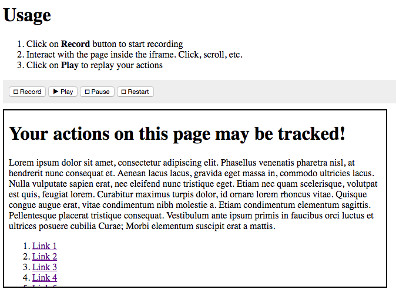

# Browser events recording & playback

A thought experiment exploring what it takes to capture user interactions in a browser context and replay them at a later time in order to evaluate UX.

<!-- MarkdownTOC autolink="true" bracket="round" -->

- [Introduction](#introduction)
- [Demo](#demo)
- [Background](#background)
    - [Testing](#testing)
    - [Network & Bandwidth](#network--bandwidth)
    - [Client environments](#client-environments)
- [Implementation](#implementation)
    - [Webpage caching](#webpage-caching)
    - [User sessions](#user-sessions)
    - [Event Recorder & Dispatcher](#event-recorder--dispatcher)
- [Resources](#resources)

<!-- /MarkdownTOC -->

---

## Introduction

The goal is to record user actions in order to understand how users interact with our webpages (**clicks**, **taps** and **mouse movements**).

Given a webpage `P` and a user session `S` we want to capture user actions `A` in real-time and reproduce the results `R` at a later time.

The two main components would be

1. client-side code that is added by webpage authors on the pages they want to track (recorder)
2. web application (server & client) that allows authors to replay tracked sessions against their webpages (player)

Whenever a user visits a webpage the recorder would:

- create a new recording session and start recording events
- take a snapshot of our webpage (html, external assets) and associate it  with the recording session (so that recorded events are replayed against the correct version of our webpage)
- periodically push recorded events to a persistent store and clear the local queue

Whenever a webpage author wants to replay a recorded session the player would:

- select the session to replay
- load the webpage snapshots associated with the selected session
- start event playback against the snapshots

## Demo

A simplistic implementation of the functionality described under the [Event Recorder & Dispatcher](#event-recorder--dispatcher) section is provided along with this document.

To run the demo clone this repository, `cd demo/`, serve `index.html` from a static server (eg. `python -m SimpleHTTPServer 5559`), and follow the instructions.

It should look like this: 

>   

## Background

The most important thing to keep in mind while developing a system like this is that **observing should not impact what is being observed**.

Under no circumstances would this system interfere with the user's normal browsing behaviour -- any observations would be irrelevant otherwise.

The second most important thing to keep in mind is that this system would be used by third-party webpages which we have no control over, and can never *ever* break even if things go horribly wrong.

To achieve that we need to pay close attention to the following areas:

- Testing
- Network connectivity & bandwidth
- Clients (browsers, devices)

### Testing

We have no control over what clients and devices are used to access our webpage. We have no control over what other scripts are loaded on the webpage or what their purpose is. We have no control over what the webpages requirements are in terms of specific browsers, versions, or devices.

For these reasons we would need extensive automated unit and functional testing across a wide range of *at least* the most common browser/version/device combinations (houndreds?).

We essentially need to deliver code that can be consumed in potentially "hostile" environments and guarantee that

1. It will never interfere and/or break other functionality provided by the webpages
2. At the very minimum the code will gracefully and silently (for the user) abort execution in case of an error

### Network & Bandwidth

Recording user events has the potential to generate large amounts of data on the client. We want to push that data to a remote persistent storage in a way that does not affect any other (more important) network requests or the user's potential to continue using the webpage (eg. run out of mobile data).

To achieve this we could implement a Service Worker that keeps track of active network requests and avoids sending recorded data to our remote storage when there are other active requests. A smarter service worker could also determine when network requests *are going to be made* (by looking at previous snapshots of the same page) and wait until all primary requests are finished before sending data.

Another way to keep bandwidth usage to a minimum is to implement a client-side mechanism that compacts data prior to sending so that requests become smaller. At the receiving end, on the server, another mechanism can expand the received data to match our prefered data structure.

### Client environments

As already mentioned there are potentially hundreds of browser/version/device combinations that will be accessing our webpage. Even though extensive testing can make sure everything works as expected in each scenario we can go a step further and provide optimized tracker builds for each case.

By providing specific builds for specific environments we can make sure that clients only download the bare minimum for our tracker to function.

This can be achieved by configuring our pre-processor/bundler (eg. webpack) to produce distinct builds according to a predefined set of criteria. There could be a build optimized for the most recent browsers where no transpiling would be necessary and a build for browsers that require certain polyfills.

## Implementation

An implementation of this system would require features such as:

- Webpage caching
- User sessions
- Event recorder & event dispatcher

### Webpage caching

The whole point of a system like this is to be able to see the impact of our updates on user engagement.

Since our webpages are constantly evolving any set of recorded actions is only applicable on the specific version of our webpage the user was interacting with. 

This means we not only have to record the user's actions but also the context of those actions (the webpage itself). A set of actions `A-1` on webpage version `P-1` cannot be applied to a later version of the webpage `P-2`.

To accommodate for this we need to keep a persistent copy of each version of each of our pages as they are consumed by our users.

#### When & how to cache

We can get the `innerHTML` of the current document and post it to our server when the page loads. We need to consider network bandwidth and availability (perhaps the user is on 3G) so caching the page does not affect user interactions in any way. Service Workers could be useful in this scenario but a fallback mechanism should be provided for non-compatible browsers.

We can trigger a server-side crawler that asynchronously accesses the webpage and caches the response. This would not affect the user experience in any way (since all the work is performed by a remote server) but it would be possible for our server to receive (and cache) a different version of our webpage than what the user was seeing (UA sniffing, cookies, server receives latest version while user was still on previous version, etc). 

#### Referenced static assets

We also need to cache any assets (JS, HTML, CSS, images, etc) referenced from our webpages since those could change between versions.

On the server, when a page is being cached we would parse any HTML, JS, and CSS found on the page for references to other assets (`script`, `style`, `link`, `meta` tags in HTML, `import` statements, `url` properties in CSS). The real tricky part would be parsing JS files to determine if there are any files being retrieved.

On the client, Service Workers could be used to listen to outgoing requests and keep track of all the assets being requested. We wouldn't care where the request originated from (CSS, JS, HTML), only that it took place. This would provide the higher accuracy than server-side parsing since we would be caching exactly what the user has been receiving.

Again, we would need to be extra careful on when and how the caching occurs so that we avoid network congestion and unnecessary data consumption.

#### Rebuilding any given version of any given webpage

For our playback mechanism to work we would need to fetch the page from our cache and display it to the user.

We would need to make sure that all assets required to rebuild the webpage are retrieved from our cache. All assets should be loaded relative to our cache back-end (and not the original webpage).

### User sessions

We define a user session as a set of actions performed by a single user during a single visit to our tracked webpages.

A new user session is created when:

- a user visits our webpage for the first time
- a user leaves our webpage and comes back at a later time
- a user logs out (if our webpage supports authentication)

Each user session must have a unique identifier and references to the cached version of webpages being visited. In addition, user sessions may have meta data associated with them (OS, navigator properties, window properties) or custom data (eg. user's name/email, if our webpages provide authentication).

sessionStorage could be used to store and retrieve the current user's session ID since that API discards stored data once the page session ends (user leaves the page).

Since sessionStorage creates a new session per page we may want to link multiple (child) sessions with a single (parent) session. This would allow us to "follow" sessions in cases where a user opens an internal link from our webpage in a new tab.

### Event Recorder & Dispatcher

This would be the core of our system. We want to specify which events we want to capture, what data to extract from each event, and how to replicate each event.

The event recorder would be a javascript library inserted into the webpage being tracked. It would add (and possibly remove) the necessary event listeners and make sure that captured events are sent to a persistent remote storage.

The event dispatcher would be used in the playback interface. Given a cached version of the webpage and a set of user actions it would replay all actions against the webpage taking into consideration the time difference between each action.

#### How to capture

The event recorder would add one event listener for each type of event we are capturing. When the event is triggered we would extract any meta data we require to replay that event. For example, in the case of a mousemove or click we want the location of the cursor, in the case of a scroll we want the new offset.

To be able to replay actions on the playback interface all events would have a timestamp associated with them.

#### How to dispatch

The event dispatcher would start from the first action in our set and replay each one successively considering the time difference between the each event. 

For example, if our first action occurred at `2017-01-01Z00:00:00` and the second action occured at `2017-01-01Z00:01:00` we would defer calling the second action by 60 seconds.

We would also need to define how each type of event is reproduced. For example, we want click events to be distinguished by a fake cursor placed on the position of the click for 2 seconds, whereas mousemove events are distinguished by another fake cursor that follows the x/y coordinates.

When replaying actions on the webpage we want to make sure that the recorder on the webpage is either disabled or removed so that we don't end up creating sessions and recordings while observing previous sessions and recordings.

## Resources

Technologies and methods that would be used include:

- [DOM Events](https://developer.mozilla.org/en-US/docs/Web/API/Event)
- [Navigation Timing](https://developer.mozilla.org/en-US/docs/Web/API/Navigation_timing_API)
- [Service Workers](https://developer.mozilla.org/en-US/docs/Web/API/Service_Worker_API)
- [Webpack](https://webpack.js.org/)
- [Babel](https://babeljs.io)
